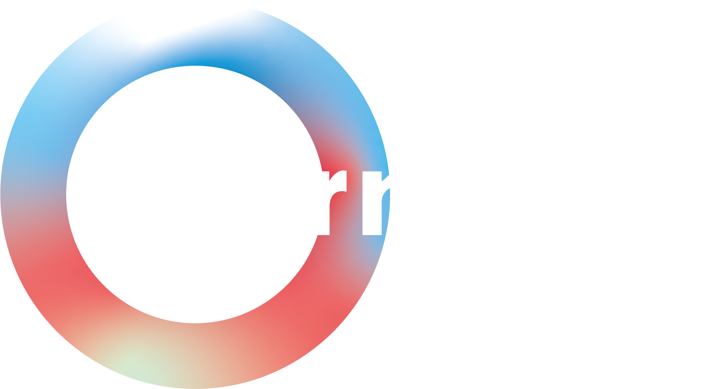

     

Java client for the Harmony API

# Class generation
All classes inside the src.main.java.model package are generated from the Harmony database. While these are provided from the repository and updated if the model changes, you might want to regenerate them if you have changed the database schema. To do so, first delete the src/main/java/model directory. After that, in the Maven sidebar of IntelliJ, run `harmony-api` > `Lifecyle` > `install`.
